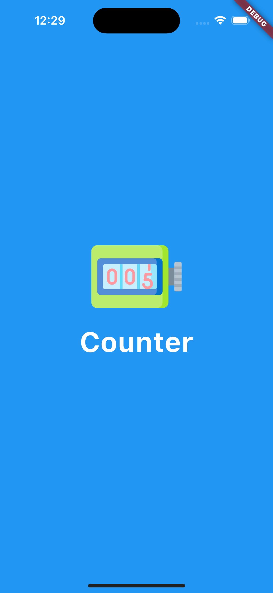
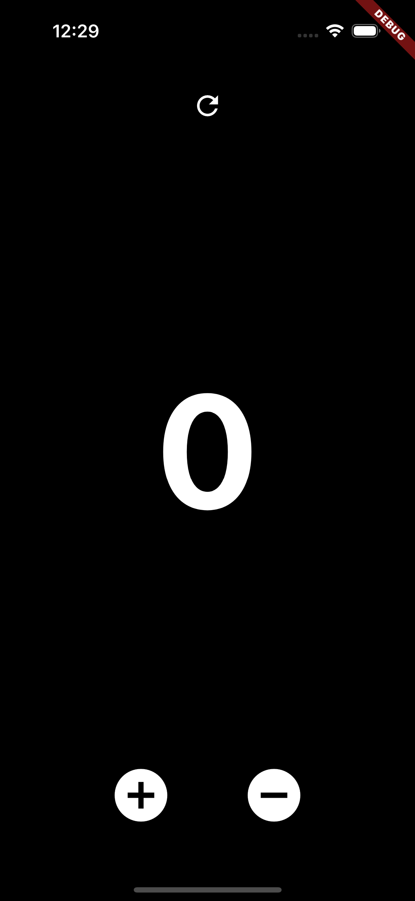
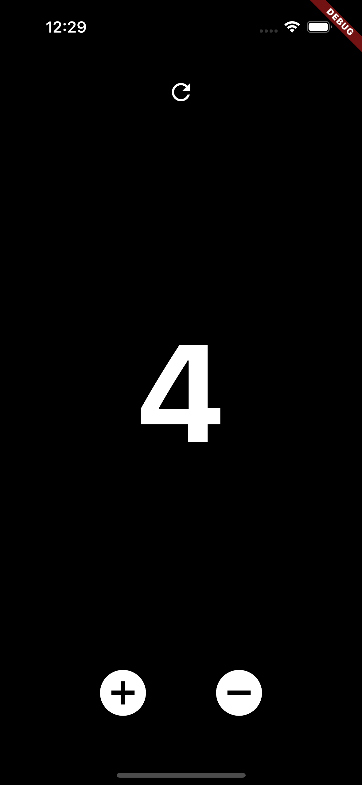

# Flutter Counter App

A simple counter app built using Flutter. This app demonstrates basic Flutter features such as state management, widget layout, and user interaction.

## Features

- **Initial Value**: The counter starts at 0.
- **Increase**: Increase the counter by 1 with a plus button press at bottom of the screen.
- **Decrease**: Decrease the counter by 0 with a minus button press.(the counter cannot go below 0) at bottom of the screen.
- **Reset**: Reset the counter to 0 with a refresh button press at top of the screen.

## Screenshots
<div style="display: flex;  gap: 10px">



</div>

## Getting Started

To run this app locally, follow these steps:

1. **Clone the Repository**

   ```bash
   git clone https://github.com/yourusername/flutter-counter-app.git
